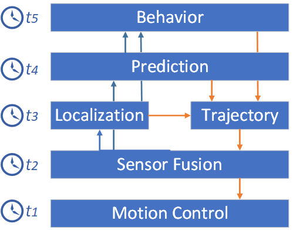
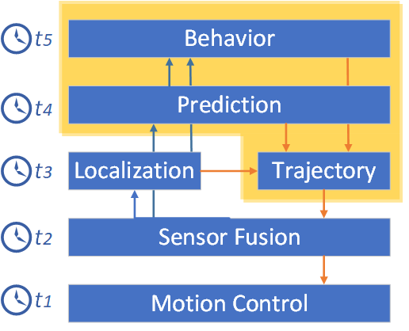
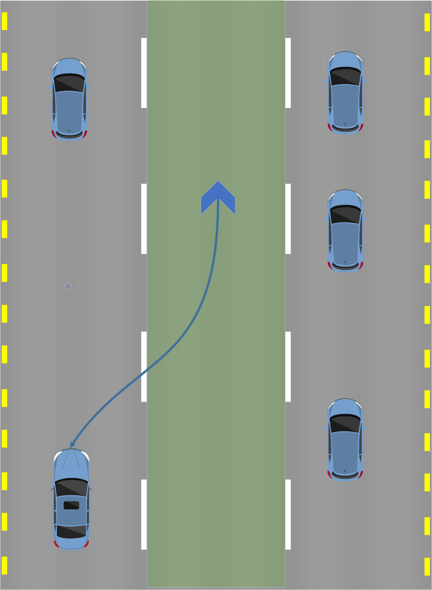
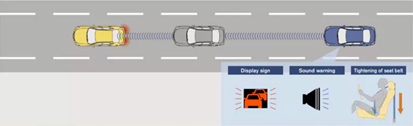
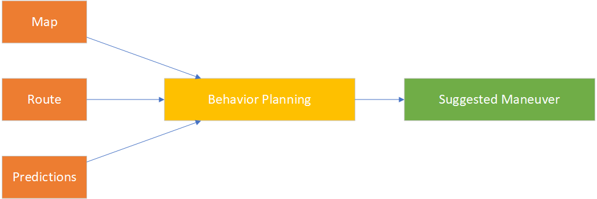
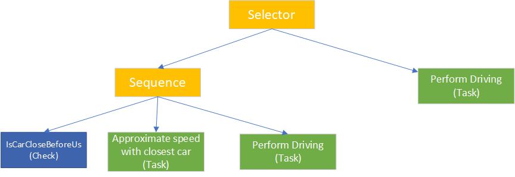
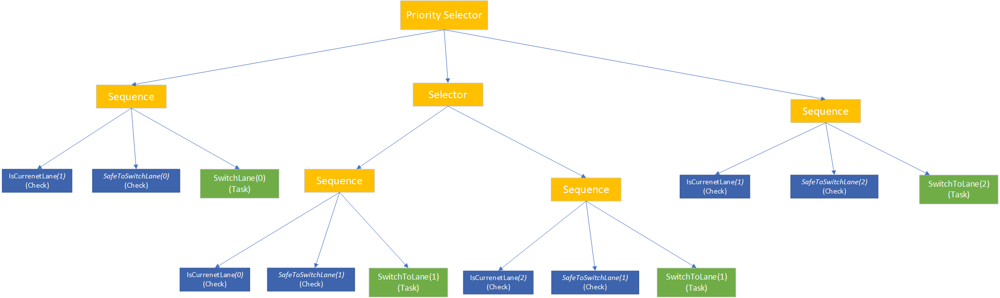
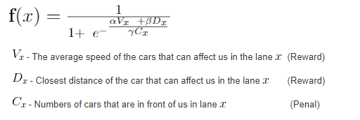
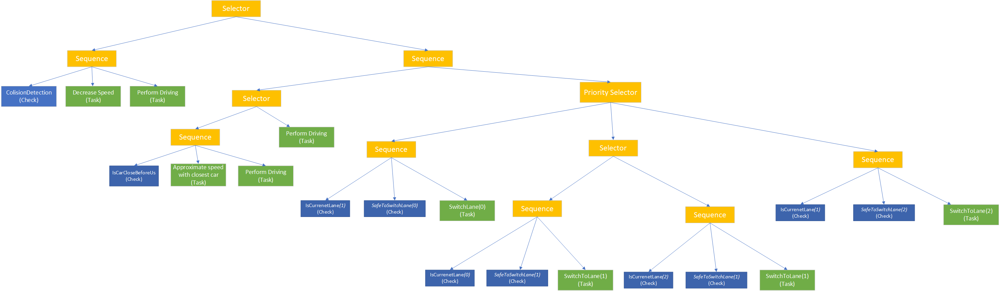

# CarND-Path-Planning-Project
Self-Driving Car Engineer Nanodegree Program

Video : 

&nbsp;&nbsp;&nbsp;&nbsp;&nbsp;&nbsp;&nbsp;&nbsp;&nbsp;&nbsp;&nbsp;&nbsp;&nbsp;&nbsp;&nbsp;&nbsp;&nbsp;&nbsp;&nbsp;&nbsp;&nbsp;&nbsp;&nbsp;&nbsp;&nbsp;&nbsp;&nbsp;&nbsp;&nbsp;&nbsp;&nbsp;&nbsp;&nbsp;&nbsp;&nbsp;&nbsp;&nbsp;&nbsp;&nbsp;&nbsp;&nbsp;&nbsp;&nbsp;&nbsp;&nbsp; [](https://www.youtube.com/watch?v=6qxCNcYnzPo)

### Goals
In this project, your goal is to safely navigate around a virtual highway with other traffic that is driving +-10 MPH of the 50 MPH speed limit. You will be provided the car's localization and sensor fusion data, there is also a sparse map list of waypoints around the highway. The car should try to go as close as possible to the 50 MPH speed limit, which means passing slower traffic when possible, note that other cars will try to change lanes too. The car should avoid hitting other cars at all cost as well as driving inside of the marked road lanes at all times unless going from one lane to another. The car should be able to make one complete loop around the 6946m highway. Since the car is trying to go 50 MPH, it should take a little over 5 minutes to complete 1 loop. Also, the car should not experience total acceleration over 10 m/s^2 and jerk that is greater than 10 m/s^3.


## Path planning in self-driving cars

Path planning and decision making for autonomous vehicles in urban environments enable self-driving cars to find the safest, most convenient, and most economically beneficial routes from point A to point B. Finding routes is complicated by all of the static and maneuverable obstacles that a vehicle must identify and bypass. Today, the major path planning approaches include the predictive control model, feasible model, and behavior-based model. Let’s first get familiar with some terms to understand how these approaches work.

* A path is a continuous sequence of configurations beginning and ending with boundary configurations. These configurations are also referred to as initial and terminating.
* Path planning involves finding a geometric path from an initial configuration to a given configuration so that each configuration and state on the path is feasible (if time is taken into account).
* A maneuver is a high-level characteristic of a vehicle’s motion, encompassing the position and speed of the vehicle on the road. Examples of maneuvers include going straight, changing lanes, turning, and overtaking.
* Maneuver planning aims at taking the best high-level decision for a vehicle while taking into account the path specified by path planning mechanisms.
* A trajectory is a sequence of states visited by the vehicle, parameterized by time and, most probably, velocity.
* Trajectory planning or trajectory generation is the real-time planning of a vehicle’s move from one feasible state to the next, satisfying the car’s kinematic limits based on its dynamics and as constrained by the navigation mode.

<p align="center">
   This is the general view of self driving autonomous system integration : 
   
</p>

<p align="center">
   The blocks inside the container are the parts of the path planning procedure;
   
</p>

### Trajectory generation :


For each efficient target, we compute the corresponding trajectory.
We send commands to the controller as a set of waypoints, i.e., discrete points (supposedly closed to one another) spread across the trajectory, often at a fixed interval equal to the controller's sampling time. 
<p align="center">
   
</p>
The controller then has to regenerate trajectory segments between two consecutive waypoints, such that manipulator reaches the next waypoint within the fixed time interval while staying within joint limits, velocity limits, and acceleration limits. However, the controller does not really consider even collision avoidance or anything else

### Prediction:
<p align="center">
   
</p>
We predict situations in over environment in order to able decision that will get you to the destination safely and efficiently
For this project I've to build collision detection, that predicts possible collision with two cars.

### Behavior:
<p align="center">

</p>

Behavior planner takes input :
* map of the world, 
* route to the destination
* prediction about what static and dynamic obstacles are likely to do

Output: Suggested maneuver for the vehicle which the trajectory planner is responsible for reaching collision-free, smooth and safe


# Behavior Tree

A Behavior Tree (BT) is a mathematical model of plan execution used in computer science, robotics, control systems, and video games. They describe switchings between a finite set of tasks in a modular fashion. Their strength comes from their ability to create very complex tasks composed of simple tasks, without worrying how the simple tasks are implemented. BTs present some similarities to hierarchical state machines with the key difference that the main building block of behavior is a task rather than a state. Its ease of human understanding make BTs less error-prone and very popular in the game developer community. BTs have been shown to generalize several other control architectures.


## Pros of using Behavior trees
* Useful when we have so many transitions and states
* Transform hardly-visible state machine into the hierarchical system
* Encapsulate and separate conditional tasks into classes
* Easy automation tests for each task.
* Better when pass/fail of tasks is central
* Reusability
* Appearance of goal-driven behavior
* Multi-step behavior
* Fast
* Recover from errors

## Cons of using Behavior trees

* Clunky for state-based behavior
* Changing behavior based on external changes
* Isn’t really thinking ahead about unique situations
*  Only as good as the designer makes it (just follows the recipes)


## Composite Node

A composite node is a node that can have one or more children. They will process one or more of these children in either a first to last sequence or random order depending on the particular composite node in question, and at some stage will consider their processing complete and pass either success or failure to their parent, often determined by the success or failure of the child nodes. During the time they are processing children, they will continue to return Running to the parent.


## Leaf

These are the lowest level node type and are incapable of having any children.

Leaves are however the most powerful of node types, as these will be defined and implemented for your intelligent system to do the actions and behaviors specific or character specific tests or actions required to make your tree actually do useful stuff.
A leaf node can be a **condition** or an **Task(Action)**.
### Condition
A condition can return true for success and false otherwise. 
### Task 
The task can return true if it is completed, false, otherwise.


## Sequences

The simplest composite node found within behaviour trees, their name says it all. A sequence will visit each child in order, starting with the first, and when that succeeds will call the second, and so on down the list of children. If any child fails it will immediately return failure to the parent. If the last child in the sequence succeeds, then the sequence will return success to its parent.

It's important to make clear that the node types in behavior trees have quite a wide range of applications. The most obvious use of sequences is to define a sequence of tasks that must be completed in entirety, and where the failure of one means further processing of that sequence of tasks becomes redundant. 

In the example below is an example of Selector hierarchy, as a part of my behavioral tree used for the path planning project :  
<p align="center">

</p>
Execution: The main goal of this selector is to choose left child (detecting whether we have a car very close before us, and adapt the speed accordingly) or right child (drive normally)

This selector will return true if and only if all children return true according to the ordered steps of execution :
1. The car is in second lane (IsCurentLane condition returns true/false)
   1. (If this block return false, then we don't continue examining the rest of the blocks in this sequence)
1. It is safe to switch lane (SafeToSwitchLane condition returns true)
   1. (if this block return false, then we don't continue examining the rest of the blocks in this sequence)
1. Successfully perform the switch task (SwitchLane task is successfully executed, returns true)
1. -----> Goal achieved

## Selector

Where a sequence is an AND, requiring all children to succeed to return success, a selector will return success if any of its children succeed and not process any further children. It will process the first child, and if it fails will process the second, and if that fails will process the third, until success is reached, at which point it will instantly return success. It will fail if all children fail. This means a selector is analogous with an OR gate, and as a conditional statement can be used to check multiple conditions to see if anyone of them is true.

In the example below is an example of Sequence hierarchy, as a part of my behavioral tree used for the path planning project :  
<p align="center">

</p>

Execution: The main goal of this selector is to choose left child (detecting whether we have car very close before us, and adapt the speed accordingly) or right child (drive normally)

This selector will return true only if one of its children returns true, execution is according to the following steps :

1. Left Child (Sequence): Returns true if there is car close before us and we are able to adapt our speed
   1. Is care close before
      1. (If this block return false, then we don't continue examining the rest of the blocks in this sequence)
   1. Approximate speed
      1. (If this block return false, then we don't continue examining the rest of the blocks in this sequence)
   1. Drive
   1. (If Left Child return true, then we don't continue examining the rest of the blocks in this selector)

1. Right Child (Task)
   1. Drive normally

## Priority Selector
Very simple, It's the same as a selector but this time they are ordered somehow.
If the priority selector is used, child behaviors are ordered in a list and tried one after another.


For this project, I used a priority selector to select and prioritize which of the lanes we should drive/switch.
Below there is a picture describing this behavior :
<p align="center">

</p>
### Prioritization equiation and estimation
For this project I prioritize which of the lanes we should drive/switch based on following formula : 
<p align="center">

</p>
The Bigger the reward is and smaller the penalty, priority for visiting the lane increases.


# Behavior Tree Architecture for Path Planing
Bellow is the complete Path planning behavior tree architecture : 
<p align="center">

</p>

# Installation 

### Simulator.
You can download the Term3 Simulator which contains the Path Planning Project from the [releases tab (https://github.com/udacity/self-driving-car-sim/releases/tag/T3_v1.2).  

To run the simulator on Mac/Linux, first make the binary file executable with the following command:
```shell
sudo chmod u+x {simulator_file_name}
```

#### The map of the highway is in data/highway_map.txt
Each waypoint in the list contains  [x,y,s,dx,dy] values. x and y are the waypoint's map coordinate position, the s value is the distance along the road to get to that waypoint in meters, the dx and dy values define the unit normal vector pointing outward of the highway loop.

The highway's waypoints loop around so the frenet s value, distance along the road, goes from 0 to 6945.554.

## Basic Build Instructions

1. Clone this repo.
2. Make a build directory: `mkdir build && cd build`
3. Compile: `cmake .. && make`
4. Run it: `./path_planning`.

Here is the data provided from the Simulator to the C++ Program

#### Main car's localization Data (No Noise)

["x"] The car's x position in map coordinates

["y"] The car's y position in map coordinates

["s"] The car's s position in frenet coordinates

["d"] The car's d position in frenet coordinates

["yaw"] The car's yaw angle in the map

["speed"] The car's speed in MPH

#### Previous path data given to the Planner

//Note: Return the previous list but with processed points removed, can be a nice tool to show how far along
the path has processed since last time. 

["previous_path_x"] The previous list of x points previously given to the simulator

["previous_path_y"] The previous list of y points previously given to the simulator

#### Previous path's end s and d values 

["end_path_s"] The previous list's last point's frenet s value

["end_path_d"] The previous list's last point's frenet d value

#### Sensor Fusion Data, a list of all other car's attributes on the same side of the road. (No Noise)

["sensor_fusion"] A 2d vector of cars and then that car's [car's unique ID, car's x position in map coordinates, car's y position in map coordinates, car's x velocity in m/s, car's y velocity in m/s, car's s position in frenet coordinates, car's d position in frenet coordinates. 

## Details

1. The car uses a perfect controller and will visit every (x,y) point it recieves in the list every .02 seconds. The units for the (x,y) points are in meters and the spacing of the points determines the speed of the car. The vector going from a point to the next point in the list dictates the angle of the car. Acceleration both in the tangential and normal directions is measured along with the jerk, the rate of change of total Acceleration. The (x,y) point paths that the planner recieves should not have a total acceleration that goes over 10 m/s^2, also the jerk should not go over 50 m/s^3. (NOTE: As this is BETA, these requirements might change. Also currently jerk is over a .02 second interval, it would probably be better to average total acceleration over 1 second and measure jerk from that.

2. There will be some latency between the simulator running and the path planner returning a path, with optimized code usually its not very long maybe just 1-3 time steps. During this delay the simulator will continue using points that it was last given, because of this its a good idea to store the last points you have used so you can have a smooth transition. previous_path_x, and previous_path_y can be helpful for this transition since they show the last points given to the simulator controller with the processed points already removed. You would either return a path that extends this previous path or make sure to create a new path that has a smooth transition with this last path.

## Tips

A really helpful resource for doing this project and creating smooth trajectories was using http://kluge.in-chemnitz.de/opensource/spline/, the spline function is in a single hearder file is really easy to use.

---

## Dependencies

* cmake >= 3.5
  * All OSes: [click here for installation instructions](https://cmake.org/install/)
* make >= 4.1
  * Linux: make is installed by default on most Linux distros
  * Mac: [install Xcode command line tools to get make](https://developer.apple.com/xcode/features/)
  * Windows: [Click here for installation instructions](http://gnuwin32.sourceforge.net/packages/make.htm)
* gcc/g++ >= 5.4
  * Linux: gcc / g++ is installed by default on most Linux distros
  * Mac: same deal as make - [install Xcode command line tools]((https://developer.apple.com/xcode/features/)
  * Windows: recommend using [MinGW](http://www.mingw.org/)
* [uWebSockets](https://github.com/uWebSockets/uWebSockets)
  * Run either `install-mac.sh` or `install-ubuntu.sh`.
  * If you install from source, checkout to commit `e94b6e1`, i.e.
    ```
    git clone https://github.com/uWebSockets/uWebSockets 
    cd uWebSockets
    git checkout e94b6e1
    ```
